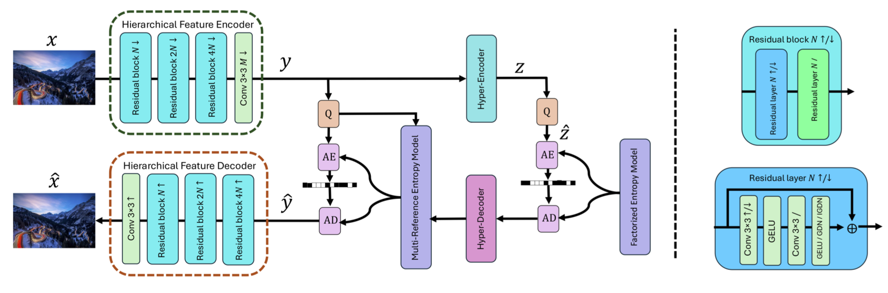
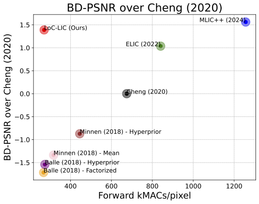

# LoC-LIC: Low Complexity Learned Image Coding Using Hierarchical Feature Transforms
## Authors
- Ayman A. Ameen<sup>1,2</sup>, Thomas Richter<sup>1</sup>, André Kaup<sup>3</sup>

<sup>1</sup>Fraunhofer Institute for Integrated Circuits IIS, Erlangen, Germany  
<sup>2</sup>Department of Physics, Faculty of Science, Sohag University, Egypt  
<sup>3</sup>Friedrich-Alexander University at Erlangen-Nürnberg, Erlangen, Germany  

[**Webpage**](#) | [**Full Paper**](#) | [**BibTeX**](#BibTeX)



## Abstract
Current learned image compression models typically exhibit high complexity, which demands significant computational resources. To overcome these challenges, we propose an innovative approach that employs hierarchical feature extraction transforms to significantly reduce complexity while preserving bit rate reduction efficiency. Our novel architecture achieves this by using fewer channels for high spatial resolution inputs/feature maps. On the other hand, feature maps with a large number of channels have reduced spatial dimensions, thereby cutting down on computational load without sacrificing performance. This strategy effectively reduces the forward pass complexity from 1256 kMAC/Pixel to just 270 kMAC/Pixel. As a result, the reduced complexity model can open the way for learned image compression models to operate efficiently across various devices and pave the way for the development of new architectures in image compression technology.


## Overview
Our novel approach utilizes hierarchical feature extraction transforms to map images from the pixel domain to the latent domain and vice versa, reducing both memory and computational complexity. The key features of our approach include:

- Low complexity autoencoder through our novel hierarchical feature extraction, which has progressively deeper feature representations with a lower number of feature maps for larger sizes and higher features for smaller sizes, allowing reduction forward pass complexity from 1256 kMAC/Pixel to only 270 kMAC/Pixel.
- Hyper-autoencoder with multi-reference entropy model maintaining competitive performance to the state-of-the-art models.
- A large dataset that spans the large part of the image space manifold.

## Results
Our proposed method demonstrates significant improvements in both computational efficiency. The following figures illustrate the performance of our model compared to state-of-the-art methods.



## Installation
To install the required dependencies, run the following commands:

```bash 

git clone https://github.com/Ayman-Ameen/loc-lic
cd loc-lic

conda create -n  loclic python=3.10
conda activate loclic
conda install pip 
pip install -r requirements.txt
```

## Usage
To test the model, run the following command:

```bash
scripts/test.py  --main_path  your_main_path --test_dataset  your_test_dataset --checkpoint  your_checkpoint --output_dir  your_output_dir
```

## Citation


## Note 

This repository is taken from several repositories and modified to fit the requirements of the paper. The original repositories are:

- [MLIC ++](https://github.com/JiangWeibeta/MLIC)
- [1d-tokenizer](https://github.com/bytedance/1d-tokenizer)